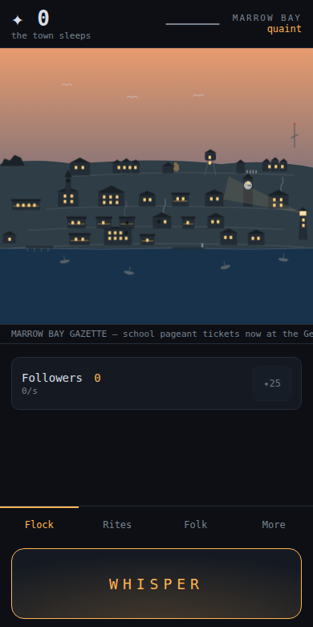
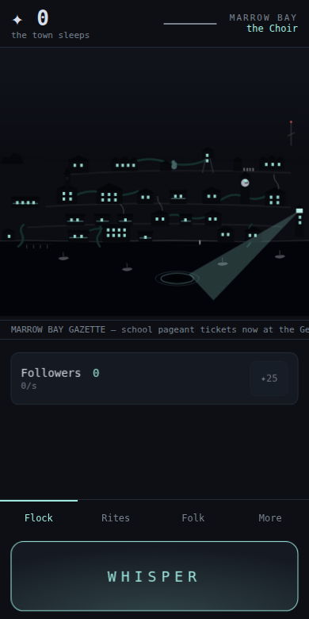

# CONGREGATION

You are a nameless thing beneath **Marrow Bay**, a quaint coastal town.
Every tap is a whisper into a sleeper's dream. Whispers earn **Dread**.
Dread converts townsfolk. The town — the centerpiece of the screen — visibly
rots as your congregation grows, until you can afford the final rite:
**the Awakening**. The town forgets; your Name persists.

Cozy idle mechanics, escalating wrongness. The horror is in the pacing, not
jump scares.

| quaint | the Choir |
|---|---|
|  |  |

## Play

No build, no dependencies, no network — open `index.html` directly, or:

```bash
python3 -m http.server 8000   # → http://localhost:8000
```

Best on a phone-shaped window. Sound unlocks on your first whisper
(toggleable under **More**). Progress saves locally and accrues while
you're away (capped at 8 hours — dreams keep poorly past that).

- **Whisper into a district.** Five of them, each paying differently —
  Hillside is richest but draws notice, Old Town quiets the Eye, the Commons
  breeds free Followers, the Verge is weak and safe. Lean on one and the
  ground goes **spent**: yield collapses and the neighbours start comparing
  notes. Rotate. (Ignoring this costs eleven minutes and 26 extra Inquiries
  over a run — measured.)
- **Flock** — Followers → Acolytes → Priests → Heralds → Avatars. Each tier
  consumes the one below, plus Dread, and murmurs more back.
- **Rites** — Whispers (tap power), Congregation (passive), Veils
  (suspicion control).
- **Folk** — twelve of Marrow Bay matter more than the rest. Their dreams
  have doors. Converting them draws the **Eye**; at its widest, an Inquiry
  comes.
- Reach the fifth corruption stage, gather 120M Dread, and **stop
  whispering**. NG+ begins immediately: each banked Name glyph is +25% to
  all Dread, forever.

A casual run reaches the Awakening in roughly 45 minutes — proven by
simulation, not vibes (see below).

## Development

Dependency-free, build-free static web: classic `<script>` files sharing one
global scope (`src/balance.js → state → town → narrative → audio → ui →
app`). The MVP feature set is tagged **`v1.0-mvp`**; Phase 9 (districts) is
the first post-MVP design change.

- [CLAUDE.md](CLAUDE.md) — session operating manual (start here)
- [ROADMAP.md](ROADMAP.md) · [STATUS.md](STATUS.md) · [DECISIONS.md](DECISIONS.md)
- [docs/](docs/) — [GDD](docs/GDD.md) · [Economy & Suspicion](docs/ECONOMY.md) ·
  [Town & Corruption](docs/TOWN.md) · [Narrative](docs/NARRATIVE.md) ·
  [Audio](docs/AUDIO.md) · [UI](docs/UI.md) · [Districts](docs/DISTRICTS.md)

**The economy is regression-tested.** Every constant and reducer lives in
[`src/balance.js`](src/balance.js); the headless sim plays optimal and
casual 45-minute runs through those exact reducers and exits non-zero if
pacing or safety invariants drift:

```bash
node sim/run.js       # pacing windows + invariants (no softlocks, caps, NG+)
```

**End-to-end tests** (dev-only tooling; `node_modules` never ships):

```bash
npm install           # @playwright/test
npx playwright test   # 19 specs: engine, economy, town, districts, narrative, audio
```

Dev URL hooks: `?stage=N` (force corruption visuals), `?grant=N` (dread),
`?vision=id` (preview an overlay), `?dev=1` (element-count logging).
